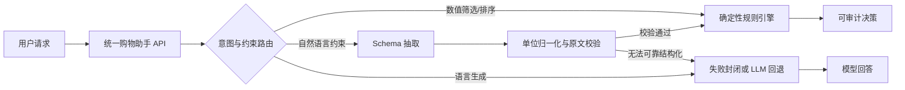

# 大模型后训练与结构化输出服务

[](https://github.com/fangyunok/ecommerce-llm-post-training/actions/workflows/ci.yml)


**可复现的大模型后训练与结构化输出服务：Prompt 约束 → JSON 抽取 → Schema 校验 → 确定性决策 → 服务化交付。**

核心设计原则是**把概率能力与确定性能力分离**：语言理解与表达交给模型，预算、阈值与排序交回 Python 规则，两者通过受 JSON Schema 约束的结构化输出连接，并用 Pydantic 二次校验和失败封闭保证只有可信数据进入决策引擎。

完整链路：

`业务定义 → 数据构造 → 基座评测 → QLoRA/SFT → 结构化输出与 Prompt 工程 → 规则—模型协同 → 推理服务`

---

## 关键结果

| 子系统 | 对照结果 | 工程含义 |
|---|---|---|
| **模型后训练（SFT / QLoRA）** | 1.5B 固定 40 题集 `18/40 → 24/40`；0.5B 峰值 `23/40` | 扩模与 SFT 均带来稳定增益 |
| **分工定位** | 数值筛选题 SFT 后为 `1/11` | 数值型硬约束交由确定性规则执行，是更优的架构选择 |
| **Prompt 工程 + 结构化输出** | 自然语言 → JSON 约束抽取，`16/16` 字段与决策全通过（原题 `11/11` + 独立改写 `5/5`） | 抽取在受支持的 schema 范围内稳定工作 |
| **规则—模型协同** | 混合架构 `34/40`（`85.0%`），较 1.5B SFT `60.0%` 提升 25 个百分点 | 数值题 `1/11 → 11/11`；口径为离线严格准确率 |
| **Schema 校验与失败封闭** | Pydantic 二次校验，校验失败返回 `422` | 未通过校验的结构化数据不进入规则决策 |
| **鲁棒性与回归** | 7 类 35 题参数化困难集 `35/35`；真实 1.5B JSON 回退 `5/5`；统一接口三路由 `3/3` | 困难集与回退集用于链路与回归验收 |
| **服务化与工程交付** | FastAPI 统一接口 + Docker + GitHub Actions（30 项单元测试全部通过） | 无 GPU 也能验证规则、抽取与评测链路 |

各实验的数据构造、评测口径与适用场景均在各实验报告中单独说明。

## 系统架构



响应会暴露实际路由、结构化抽取结果与候选集合，便于定位错误发生在抽取、规则还是生成阶段。完整分层见[架构说明](docs/architecture.md)。

## 设计亮点

- **职责分离架构**：模型负责语言理解与表达，Python 规则负责预算、阈值和排序，避免让概率模型承担确定性计算。
- **结构化输出协议层**：Prompt 约束 → JSON 解析 → Pydantic Schema 二次校验 → 失败封闭，全链路可审计。
- **规则优先 + 模型回退**：规则可处理时零模型调用；规则无法解析时，由真实 1.5B 模型输出 JSON，再经单位归一化与原文约束方向校验兜底。
- **分层评测框架**：严格准确率、字段级抽取准确率、困难集回归、路由验收分项报告，而非只报一个混合总分。
- **可审计响应**：返回选中商品、合格候选列表、推荐理由与 `deterministic_rules` 来源标记，每一步可复现。
- **工程化交付**：FastAPI 统一接口、Docker Compose、请求 ID 日志、健康检查与 GitHub Actions 持续集成。

## 可迁移性

- **与任务无关、可直接复用**：结构化输出协议层（Prompt 约束 → JSON 解析 → Pydantic Schema 二次校验 → 失败封闭）、规则—模型协同路由层（概率能力与确定性能力分离）、分层评测框架（严格准确率 / 字段级抽取准确率 / 困难集回归 / 路由验收）。
- **与本任务绑定**：电商商品字段 schema、预算 / 容量 / 尺寸等领域约束定义、固定业务评测集。
- **迁移到新的业务场景时**，只需替换后两者；结构化输出协议层、协同路由层与评测协议可直接沿用。

## 项目状态

### 训练与评测

| 模块 | 状态 | 结果 |
|---|---|---|
| 本地 CPU 推理 API | 已完成 | FastAPI 健康检查与聊天接口可用 |
| 固定业务评测（8 题） | 已完成 | 基座严格准确率 `2/8`（25%），首轮 SFT 后 `4/8`（50%） |
| SFT 数据 v2 | 已完成 | 1800 条训练、225 条验证，9 类均衡分布 |
| 扩展业务评测（40 题） | 已完成 | 实验001 `17/40`（42.5%），实验002 `23/40`（57.5%） |
| 数据质量对照实验 | 已完成 | 否定、数值筛选和摘要提升，同时定位预算与拒答的变化 |
| 实验003 恢复测试 | 已完成 | `21/40`（52.5%），恢复拒答能力，并据此收敛数据策略 |
| 1.5B 模型规模对照 | 已完成 | 基座 `18/40`（45.0%），SFT 后 `24/40`（60.0%） |
| 规则与模型协同 | 已完成第一版 | 11 道数值题规则路由全通过，混合结果 `34/40`（85.0%） |
| 自然语言约束抽取 | 已完成第一版 | 原题 `11/11`、独立改写题 `5/5`，字段与决策均全通过 |
| 困难集与鲁棒性 | 已完成 | 35 题、7 类参数化困难集全部通过 |
| 规则优先与 LLM 回退 | 已完成 | 规则成功零模型调用，Schema 失败封闭；真实 1.5B 回退已验证 |
| 真实 1.5B 抽取回退 | 已完成 | 首轮 `3/5`，加入单位归一化与原文约束校验后 `5/5`；统一接口 `3/3` |
| QLoRA/SFT 首轮训练 | 已完成 | RTX 3090 训练约 11 分 13 秒，Adapter 已保存 |

### 服务与交付

| 模块 | 状态 | 结果 |
|---|---|---|
| 统一购物助手接口 | 已完成 | `/v1/shopping-assistant` 统一决策、抽取回退与语言任务 |
| Docker 与 CI | 已完成并验证 | GitHub Actions 单测与生产镜像构建成功，总耗时 2 分 13 秒 |

自动化测试共 30 项，在本地与 CI 上全部通过。

## 实验索引

实验002的完整对照、分类变化与结论见[实验002报告](docs/experiment_002_qlora.md)。
实验003的数据设计和结果见[实验003计划](docs/experiment_003_plan.md)与[实验003报告](docs/experiment_003_qlora.md)。
1.5B模型规模对照见[实验004计划](docs/experiment_004_plan.md)与[实验004报告](docs/experiment_004_qlora.md)。
规则与模型协同的设计、评测口径见[实验005报告](docs/experiment_005_hybrid_rules.md)。
自然语言结构化抽取的实现与泛化测试见[实验006报告](docs/experiment_006_extraction.md)。
困难集、单位归一化和多级排序结果见[实验007报告](docs/experiment_007_robustness.md)。
真实1.5B模型抽取回退及统一接口验收见[实验008报告](docs/experiment_008_llm_fallback.md)。
首轮QLoRA/SFT闭环见[实验001报告](docs/experiment_001_qlora.md)。

最终系统架构见[架构说明](docs/architecture.md)，部署步骤见[生产部署手册](docs/production_deployment.md)，项目设计与结果总结见[项目讲解材料](docs/interview_materials.md)。

## 5分钟验证核心能力

无需下载模型即可运行规则、抽取和鲁棒性回归：

```powershell
python -m pip install -r requirements-test.txt
python -m unittest discover -s tests -v
python scripts\generate_robustness_cases.py
python scripts\evaluate_robustness.py
```

需要体验完整 API 时，再安装推理依赖并启动服务：

```powershell
python -m pip install -r requirements-serving.txt
powershell -ExecutionPolicy Bypass -File scripts\start_api.ps1
```

## 当前可运行服务

本地 CPU 基线使用 `Qwen/Qwen2.5-0.5B-Instruct + Transformers + FastAPI`。

### 从 GitHub 克隆后安装

```powershell
git clone <你的仓库地址>
cd <仓库目录>
python -m venv .venv
.\.venv\Scripts\Activate.ps1
python -m pip install -r requirements-serving.txt
```

模型权重不纳入版本管理。若本地没有 `models/Qwen2.5-0.5B-Instruct`，服务首次启动会从 Hugging Face 下载；国内网络可用 ModelScope 提前下载：

```powershell
python -m pip install modelscope
modelscope download --model Qwen/Qwen2.5-0.5B-Instruct --local_dir models\Qwen2.5-0.5B-Instruct
```

### 启动服务

```powershell
cd <项目目录>
powershell -ExecutionPolicy Bypass -File scripts\start_api.ps1
```

启动后打开 `http://127.0.0.1:8000/docs`，或在另一个 PowerShell 执行：

```powershell
powershell -ExecutionPolicy Bypass -File scripts\smoke_test.ps1
```

主要接口：

- `GET /health`：模型状态、设备与加载错误。
- `POST /v1/chat/completions`：聊天生成，返回 token 用量和耗时。
- `POST /v1/rule-recommendations`：接收结构化商品、硬约束和排序字段，返回可审计的确定性决策。
- `POST /v1/natural-language-recommendations`：将受支持的自然语言商品比较请求抽取成 JSON，再调用规则引擎决策。
- `POST /v1/shopping-assistant`：统一业务入口；支持 `auto/decision/chat` 模式并返回实际路由。

若已有 LoRA Adapter，可设置 `ADAPTER_PATH` 后复用同一服务。

### 运行固定基线评测

保持 API 运行，在另一个 PowerShell 执行：

```powershell
powershell -ExecutionPolicy Bypass -File scripts\evaluate_baseline.ps1
```

评测结果保存到 `outputs/evaluation/baseline.jsonl`，后续微调模型使用同一评测集对比。当前基座评测结果：`2/8` 严格通过，准确率 `25%`；首轮 SFT 后为 `4/8`，准确率 `50%`。完整记录见[首轮 QLoRA 实验报告](docs/experiment_001_qlora.md)。

### 生成 SFT 数据

```powershell
python scripts\generate_sft_data.py
```

默认生成 1800 条训练数据和 225 条验证数据，格式为对话式 prompt/completion。v2 重点覆盖预算边界、否定属性、数值字段绑定和多商品筛选。

### 在 NVIDIA GPU 环境进行 QLoRA

```powershell
python -m pip install -r requirements-training.txt
powershell -ExecutionPolicy Bypass -File scripts\train_qlora.ps1
```

本机没有 CUDA，训练命令在 Colab、AutoDL 或实验室 GPU 服务器执行。首轮实验已在 AutoDL RTX 3090 上完成；训练完成后可将 `outputs/sft_adapter` 作为 `ADAPTER_PATH` 接入现有 API。训练前先阅读并执行 [QLoRA 运行手册](docs/qlora_runbook.md)中的环境体检与参数检查。

## 实验演进

1. **实验001：跑通闭环。** 完成首轮 QLoRA/SFT 与固定集评测，严格准确率由 `2/8` 提升到 `4/8`。
2. **实验002—003：数据质量对照。** 扩展到 40 题，定位否定、数值筛选、预算和拒答之间的权衡，并据此收敛数据策略。
3. **实验004：模型规模对照。** 1.5B 基座 `18/40`，SFT 后 `24/40`，确认扩模有效，同时明确硬约束更适合交给确定性规则。
4. **实验005—007：系统设计升级。** 将数值问题交给规则引擎，补充自然语言抽取、单位归一化、多级排序和 35 题困难集。
5. **实验008：真实模型回退。** 1.5B 抽取首轮 `3/5`，经约束校验后 `5/5`；统一接口验收 `3/3`。

运行规则与模型协同评测：

```powershell
python scripts\evaluate_hybrid.py
python scripts\evaluate_extraction.py
python scripts\evaluate_llm_fallback.py
```

这三项评测都不加载大模型、不需要 GPU。`85.0%` 的混合结果基于已结构化 JSON；实验006 另行验证了受支持自然语言的自动抽取，用分层指标（字段抽取 / 规则决策 / 端到端）分别报告。

## 项目目录

```text
data/
  processed/    清洗、划分后的训练数据
  eval/         固定业务评测集
src/            训练、评测和推理服务代码
scripts/        数据生成、训练、评测和部署脚本
tests/          30 项单元测试
docs/           架构、部署、实验报告与面试材料
```

## 硬件约定

本机负责开发和小规模验证；QLoRA/DPO 正式训练使用 NVIDIA GPU 环境。代码保持同一套目录和配置，避免在本机与云端之间反复修改。

## 安全与复现

- 模型权重、缓存、临时训练输出和环境变量已由 `.gitignore` 排除；体积很小的基线评测结果保留在仓库中。
- 仓库不包含 API Key 或密码。
- 发布前运行检查：

```powershell
python -m unittest discover -s tests -v
python -m pip check
```

## Roadmap

- **偏好对齐**：在新增偏好数据质量可控且具备独立测试集时，引入 DPO 偏好对齐实验。
- **检索增强**：为商品知识补充 RAG 链路，与本仓库的后训练对照结论形成互补。
- **抽取覆盖面**：扩展人工改写测试集与失败样本，评估受 JSON Schema 约束的大模型抽取路线，并持续分项报告抽取 / 决策 / 端到端准确率。
- **在线化**：接入真实匿名业务样本与字段级抽取评测、人工审核、GPU 容器压测、超时与并发控制、监控告警，再逐步灰度。

## License

MIT，详见 [LICENSE](LICENSE)。
