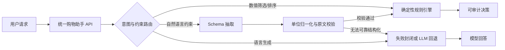

# 电商大模型后训练与推理服务

[](https://github.com/fangyunok/ecommerce-llm-post-training/actions/workflows/ci.yml)

这是一个面向电商商品理解与推荐场景的可复现大模型后训练项目。它重点回答两个问题：**小模型后训练能改善哪些任务**，以及**哪些确定性业务约束不应该交给大模型猜测**。

完整链路：

`业务定义 → 数据构造 → 基座评测 → QLoRA/SFT → 自动评测 → 规则—模型协同 → 推理服务`

## 先看结论

| 关注点 | 结论 | 可验证证据 |
|---|---|---|
| 后训练是否有效 | 1.5B 模型在40题固定集上由18/40提升到24/40 | [实验004报告](docs/experiment_004_qlora.md)与仓库内评测输出 |
| 继续堆训练是否最优 | 否；纯模型仍不擅长严格数值约束 | [实验002](docs/experiment_002_qlora.md)、[实验003](docs/experiment_003_qlora.md)错误对照 |
| 最终方案 | 数值决策走规则，语言任务走模型，混合结果34/40 | [实验005报告](docs/experiment_005_hybrid_rules.md) |
| 自然语言如何进入规则系统 | Schema抽取、单位归一化、原文约束校验和失败封闭 | [实验006](docs/experiment_006_extraction.md)、[实验008](docs/experiment_008_llm_fallback.md) |
| 是否可交付 | FastAPI统一接口、Docker镜像、CI测试与困难集回归 | [架构说明](docs/architecture.md)、[部署手册](docs/production_deployment.md) |

> 这些结果用于证明实验与工程闭环，不代表线上业务指标。固定集和合成数据的规模、模板偏差及适用边界均在各实验报告中单独披露。

## 系统架构



这个仓库聚焦**后训练、评测和规则—模型协同**；不把检索系统、通用 Agent 编排或纯推荐模型训练混在同一个项目里。

## 项目状态

| 模块 | 状态 | 结果 |
|---|---|---|
| 本地CPU推理API | 已完成 | FastAPI健康检查与聊天接口可用 |
| 固定业务评测 | 已完成 | 基座严格准确率2/8（25%） |
| SFT数据v2 | 已完成 | 1800条训练、225条验证，9类均衡分布 |
| 扩展业务评测 | 已完成 | 实验001为17/40（42.5%），实验002为23/40（57.5%） |
| 数据质量对照实验 | 已完成 | 否定、数值筛选和摘要提升，但预算与拒答退化 |
| 实验003恢复测试 | 已完成 | 21/40（52.5%），恢复拒答但总体低于实验002 |
| 1.5B模型规模对照 | 已完成 | 基座18/40（45.0%），SFT后24/40（60.0%） |
| 规则与模型协同 | 已完成第一版 | 11道数值题规则路由全通过，混合结果34/40（85.0%） |
| 自然语言约束抽取 | 已完成第一版 | 原题11/11、独立改写题5/5，字段与决策均全通过 |
| 困难集与鲁棒性 | 已完成 | 35题、7类参数化困难集全部通过，19项测试通过 |
| 规则优先与LLM回退 | 已完成代码与模拟验证 | 规则成功零模型调用，Schema失败封闭；待GPU真实模型验证 |
| 统一购物助手接口 | 已完成 | `/v1/shopping-assistant`统一决策、抽取回退与语言任务 |
| Docker与CI | 已完成并验证 | GitHub Actions单测与生产镜像构建成功，总耗时2分13秒 |
| 真实1.5B抽取回退 | 已完成 | 首轮3/5，加入单位归一化与原文约束校验后5/5；统一接口3/3 |
| QLoRA/SFT首轮训练 | 已完成 | RTX 3090训练约11分13秒，Adapter已保存 |
| SFT固定业务评测 | 已完成 | 严格准确率4/8（50%），较基座提升25个百分点 |
| DPO偏好对齐 | 未开始 | 后续阶段 |
| RAG与购物Agent | 未开始 | 后续阶段 |

> 首轮结果证明训练与部署闭环可运行，但8条固定评测集规模较小，合成训练集模板规律较强；50%不能解释为真实线上业务准确率。

实验002的完整对照、分类变化和局限性见[实验002报告](docs/experiment_002_qlora.md)。
实验003的数据设计和停止条件见[实验003计划](docs/experiment_003_plan.md)。
实验003结果见[实验003报告](docs/experiment_003_qlora.md)。
1.5B模型规模对照见[实验004计划](docs/experiment_004_plan.md)。
实验004的完整结果、分类变化和局限性见[实验004报告](docs/experiment_004_qlora.md)。
规则与模型协同的设计、评测口径和边界见[实验005报告](docs/experiment_005_hybrid_rules.md)。
自然语言结构化抽取的实现与泛化测试见[实验006报告](docs/experiment_006_extraction.md)。
困难集、单位归一化和多级排序结果见[实验007报告](docs/experiment_007_robustness.md)。
真实1.5B模型抽取回退及统一接口验收见[实验008报告](docs/experiment_008_llm_fallback.md)。
最终系统架构见[架构说明](docs/architecture.md)，部署步骤见[生产部署手册](docs/production_deployment.md)，项目设计与结果总结见[项目讲解材料](docs/interview_materials.md)。

## 5分钟验证核心能力

无需下载模型即可运行规则、抽取和鲁棒性回归：

```powershell
python -m pip install -r requirements-test.txt
python -m unittest discover -s tests -v
python scripts\generate_robustness_cases.py
python scripts\evaluate_robustness.py
```

需要体验完整 API 时，再安装推理依赖并启动服务：

```powershell
python -m pip install -r requirements-serving.txt
powershell -ExecutionPolicy Bypass -File scripts\start_api.ps1
```

## 当前可运行服务

本地CPU基线使用 `Qwen/Qwen2.5-0.5B-Instruct + Transformers + FastAPI`。

### 从GitHub克隆后安装

```powershell
git clone <你的仓库地址>
cd <仓库目录>
python -m venv .venv
.\.venv\Scripts\Activate.ps1
python -m pip install -r requirements-serving.txt
```

模型权重不会提交到GitHub。若本地没有`models/Qwen2.5-0.5B-Instruct`，服务首次启动会从Hugging Face下载；也可以在国内网络使用ModelScope提前下载：

```powershell
python -m pip install modelscope
modelscope download --model Qwen/Qwen2.5-0.5B-Instruct --local_dir models\Qwen2.5-0.5B-Instruct
```

### 启动服务

```powershell
cd <项目目录>
powershell -ExecutionPolicy Bypass -File scripts\start_api.ps1
```

启动后打开 `http://127.0.0.1:8000/docs`，或在另一个PowerShell执行：

```powershell
powershell -ExecutionPolicy Bypass -File scripts\smoke_test.ps1
```

主要接口：

- `GET /health`：模型状态、设备与加载错误。
- `POST /v1/chat/completions`：聊天生成，返回token用量和耗时。
- `POST /v1/rule-recommendations`：接收结构化商品、硬约束和排序字段，返回可审计的确定性决策。
- `POST /v1/natural-language-recommendations`：将受支持的自然语言商品比较请求抽取成JSON，再调用规则引擎决策。
- `POST /v1/shopping-assistant`：统一业务入口；支持`auto/decision/chat`模式并返回实际路由。

若后续已有LoRA Adapter，可设置 `ADAPTER_PATH` 后复用同一服务。

### 运行固定基线评测

保持API运行，在另一个PowerShell执行：

```powershell
powershell -ExecutionPolicy Bypass -File scripts\evaluate_baseline.ps1
```

评测结果保存到 `outputs/evaluation/baseline.jsonl`，后续微调模型使用同一评测集对比。

当前基座评测结果：`2/8`严格通过，准确率`25%`。首轮SFT后为`4/8`，准确率`50%`。完整记录见[首轮QLoRA实验报告](docs/experiment_001_qlora.md)。

### 生成SFT数据

```powershell
python scripts\generate_sft_data.py
```

默认生成1800条训练数据和225条验证数据，格式为对话式prompt/completion。v2重点增加预算边界、否定属性、数值字段绑定和多商品筛选。

### 在NVIDIA GPU环境进行QLoRA

```powershell
python -m pip install -r requirements-training.txt
powershell -ExecutionPolicy Bypass -File scripts\train_qlora.ps1
```

本机没有CUDA，训练命令应在Colab、AutoDL或实验室GPU服务器执行。首轮实验已在AutoDL RTX 3090上完成；训练完成后可将`outputs/sft_adapter`作为`ADAPTER_PATH`接入现有API。

训练前先阅读并执行[QLoRA运行手册](docs/qlora_runbook.md)中的环境体检与参数检查。

## 实验演进

1. **实验001：跑通闭环。** 完成首轮QLoRA/SFT与固定集评测，严格准确率由2/8提升到4/8。
2. **实验002—003：数据质量对照。** 扩展到40题，定位否定、数值筛选、预算和拒答之间的权衡，并记录一次未带来总体提升的恢复实验。
3. **实验004：模型规模对照。** 1.5B基座18/40，SFT后24/40，确认扩模有效但不足以可靠执行硬约束。
4. **实验005—007：改变系统设计。** 将数值问题交给规则引擎，补充自然语言抽取、单位归一化、多级排序和35题困难集。
5. **实验008：验证真实模型回退。** 1.5B抽取首轮3/5，经约束校验后5/5；统一接口验收3/3。

下一阶段只在新增偏好数据质量可控、且有独立测试集时开展DPO；RAG和购物Agent不用于替代本仓库的后训练对照结论。

### 运行规则与模型协同评测

实验005复用实验004保存的1.5B模型输出，并将11道数值筛选题路由到确定性规则引擎：

```powershell
python scripts\evaluate_hybrid.py
python scripts\evaluate_extraction.py
python scripts\evaluate_llm_fallback.py
```

这两项评测都不加载大模型、不需要GPU。85.0%的混合结果使用已结构化JSON；实验006另行验证了受支持自然语言的自动抽取，但其表达范围仍有限，不能将结果直接解释为开放域线上准确率。

## 上传GitHub前

模型权重、缓存、临时训练输出和环境变量已由`.gitignore`排除；会保留体积很小的基线评测结果。仓库不包含API Key或密码。

运行发布前检查：

```powershell
python -m unittest discover -s tests -v
python -m pip check
```

本项目暂未选择开源许可证；公开仓库可以展示和阅读，但如需明确允许他人复制、修改或再发布，应由仓库所有者选择并添加LICENSE。

## 项目目录

```text
data/
  processed/    清洗、划分后的训练数据
  eval/         固定业务评测集
src/            训练、评测和推理服务代码
scripts/        数据生成、训练、评测和部署脚本
tests/          单元测试
docs/           部署与QLoRA运行文档
```

## 硬件约定

本机负责开发和小规模验证；QLoRA/DPO 正式训练使用 NVIDIA GPU 环境。代码会保持同一套目录和配置，避免在本机与云端之间反复修改。
