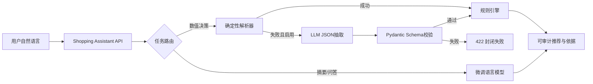

# 最终系统架构

```mermaid
flowchart LR
    U[用户自然语言] --> API[Shopping Assistant API]
    API --> R{任务路由}
    R -->|数值决策| P[确定性解析器]
    P -->|成功| E[规则引擎]
    P -->|失败且启用| X[LLM JSON抽取]
    X --> V[Pydantic Schema校验]
    V -->|通过| E
    V -->|失败| F[422 封闭失败]
    R -->|摘要/问答| L[微调语言模型]
    E --> A[可审计推荐与依据]
    L --> A
```

核心原则是将概率能力与确定性能力分离：模型负责语言理解和表达，Python规则负责预算、阈值和排序。响应暴露路由、结构化抽取与候选结果，便于定位错误发生在抽取、规则还是生成阶段。

模型权重不进入Git仓库。服务通过环境变量选择基座、Adapter和是否启用LLM抽取回退。
